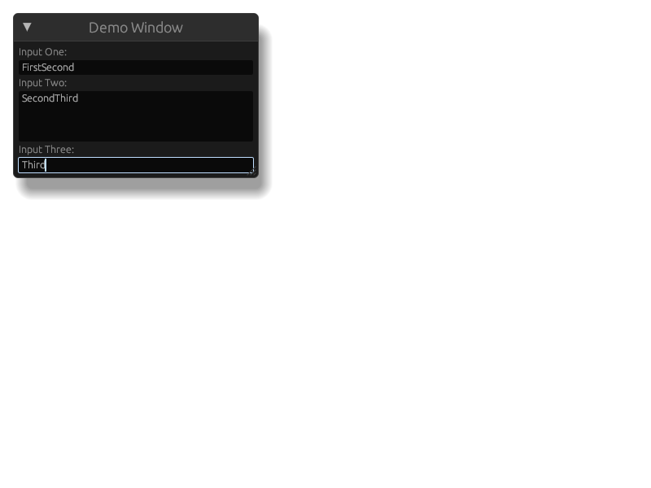

This repo is a demonstration of a bug/issue i have with "egui_kittest".

### How to reproduce
#### On Nix
If you are using nix, then use the "flake.nix" & "flake.lock" file to set up the environment for this example.

#### Other
The only requirement is to have rust "1.85" installed.

---

Run "cargo test" to run the tests, with the output images generated in "./tests/snapshots"

### Expectation
I expect the "example.png" file to only have one entry per text entry.

