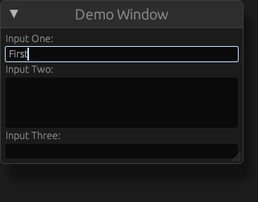

This repo is a demonstration of a bug/issue i have with "egui_kittest".

### How to reproduce
#### On Nix
If you are using nix, then use the "flake.nix" & "flake.lock" file to set up the environment for this example.

#### Other
The only requirement is to have rust "1.85" installed.

---

Run "cargo test" to run the tests, with the output images generated in "./tests/snapshots"

### Expectation
I expect there to only be one input per textbox.

#### One by one
This is the output from trying to input text into the first empty text box three times.

#### All at once
This is the output from adding text to each box during the same frame.

### Sanity Check
As a sanity check i tried just adding text to the first text box, which does work as expected.

